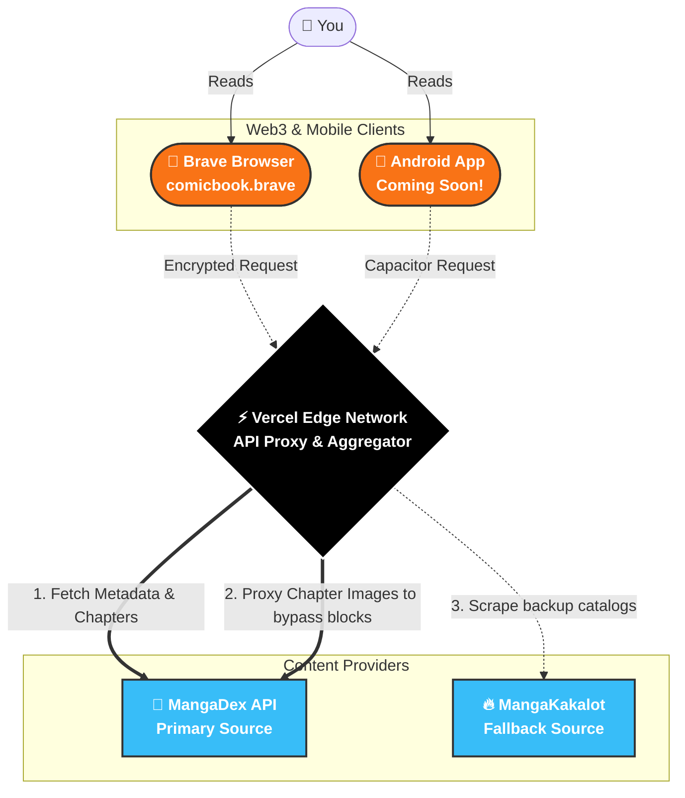

<div align="center">
  
  
  <p><strong>A modern, fast, and Web3-ready platform for reading your favorite manga.</strong></p>
  
  <p>
    
    
    
    
  </p>
</div>

<br />

## 📱 Android App — Coming Soon!

<div align="center">
  
  <p>We are currently packaging our highly-optimized web experience into a native Android APK!</p>
  <p>Soon, you will be able to download the official MangaBook Android app, featuring native hardware back-button support, edge-proxied image caching, and a flawless full-screen reading experience.</p>
</div>


## 🌐 Web3 Ready: Visit us on the Decentralized Web!

MangaBook is proudly hosted on the decentralized web. You can access our uncensorable, resilient Web3 domain exclusively through the **Brave Browser**:

🚀 **[comicbook.brave](comicbook.brave)** 
> *(Note: This Web3 domain link will only open in the Brave browser)*

### Why Web3?
Embracing Web3 technology gives our readers and our platform incredible advantages over traditional hosting:
- 🛡️ **Censorship Resistant:** Decentralized hosting ensures that your access to manga and literature cannot be blocked, taken down, or restricted by centralized authorities.
- 🔗 **Unstoppable & Resilient:** With no single point of failure (like a traditional central server), the website remains online even if individual nodes go down.
- 👁️ **Privacy First:** Web3 infrastructure fundamentally respects user privacy. No corporate trackers, no invasive data harvesting, and no central entity monitoring your reading habits.
- 🌍 **Community-Owned:** Web3 shifts the power back to the users and creators, fostering a free, open, and resilient internet.


## ⚙️ How It Works (Architecture)

MangaBook acts as a lightning-fast aggregator and proxy, ensuring that your ISP or local network restrictions never get in the way of your reading.




## ✨ Features

- **📖 Seamless Reading Experience:** Clean, intuitive, and distraction-free reader interface optimized for both desktop and mobile.
- **⚡ Lightning Fast Proxying:** All chapter images are proxied through our servers, meaning broken images from ISP blocks are a thing of the past.
- **🔍 Advanced Discovery:** Instantly search and find what you're looking for across aggregated sources.
- **🚫 Ad-Free:** Pure reading, exactly as it should be.

## 🚀 Tech Stack

- **Framework:** [Next.js](https://nextjs.org/) (App Router)
- **Styling:** [Tailwind CSS](https://tailwindcss.com/)
- **Icons:** [Lucide React](https://lucide.dev/)
- **Mobile Integration:** [Capacitor](https://capacitorjs.com/) for building the Android APK.
- **Data Integration:** MangaDex API with Edge-Proxied Images

## 🛠️ Local Development

First, run the development server:

```bash
npm run dev
# or
yarn dev
# or
pnpm dev
```

Open [http://localhost:3000](http://localhost:3000) with your browser to see the result.
